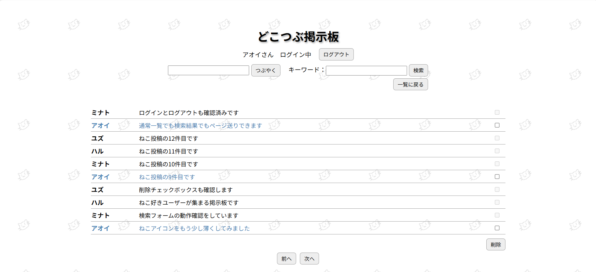
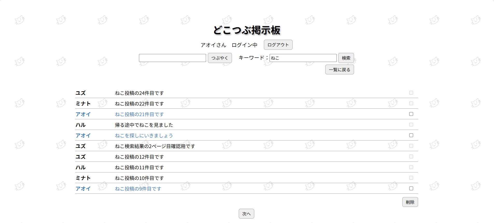
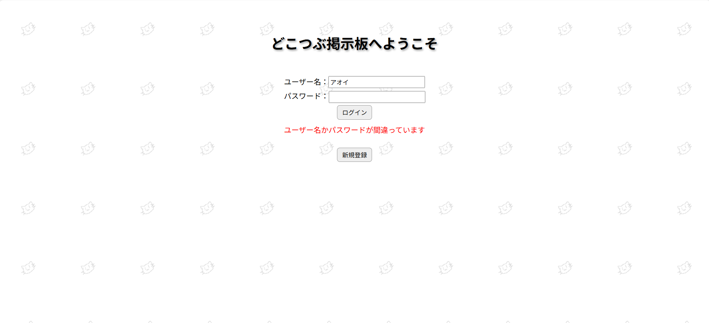

# Dokotubu Forum

JavaとServletとJSPで作成した一言つぶやき掲示板アプリです。

## 機能
- ログイン
- 新規ユーザー登録
- つぶやき投稿
- つぶやき一覧表示（1ページ10件表示）
- ページ送り
- 単一キーワード検索
- 検索結果からページ送り
- 自分の投稿のみ削除可能
- ログアウト

## 使い方
1. Tomcatを起動
2. ブラウザでアプリへアクセス
3. ユーザー名とパスワードを入力してログイン
4. つぶやき一覧を確認
5. 好きな内容のつぶやきを投稿
6. キーワードを入力して検索
7. チェックボックスでつぶやきを選択して削除
8. ログアウト

## 使用技術
- Java
- Servlet
- JSP
- HTML/CSS
- H2 Database
- JDBC
- Apache Tomcat
- Git/GitHub

## 学習内容
- JavaBeans
- MVCモデル
- フォワード、リダイレクト
- リクエストスコープ、セッションスコープ、アプリケーションスコープ
- JDBCによるデータベース操作
- DAOパターン
- CSVファイルからH2データベースへの移行
- Git/GitHub

## 今後の更新予定
- ユーザー名/つぶやき内容に絞った検索
- コードのリファクタリング

## スクリーンショット

### つぶやき一覧画面

### つぶやき検索結果画面

### ログイン失敗時画面

### ホバーエフェクト
投稿一覧では、マウスカーソルを重ねると背景色が変化します。
動画：`screenshots/pointer-hover.mp4`
